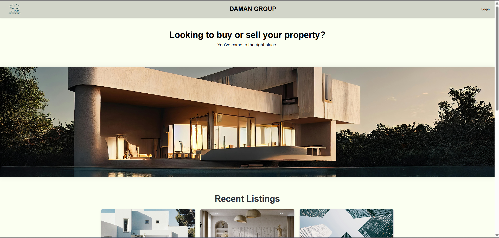
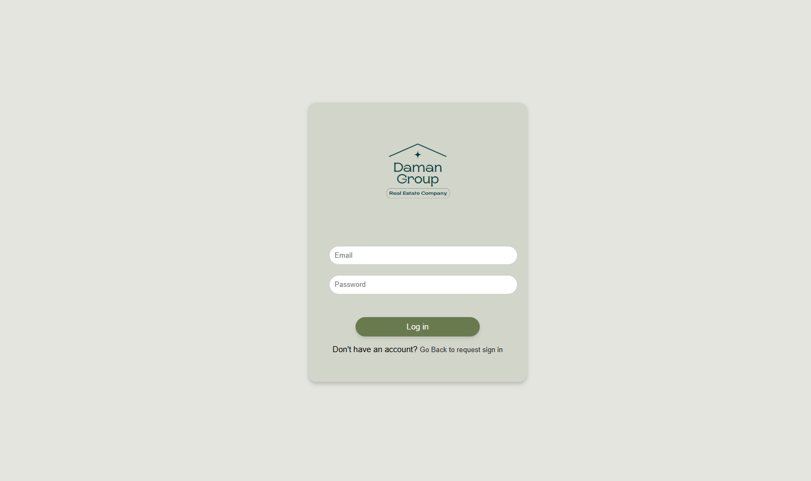
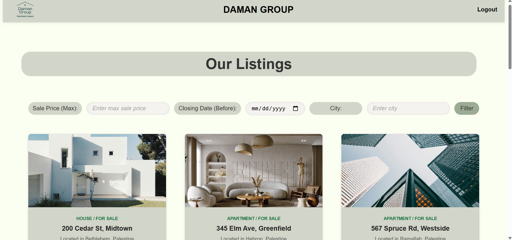
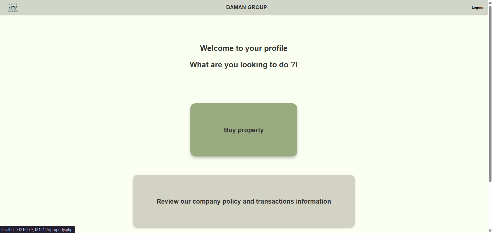
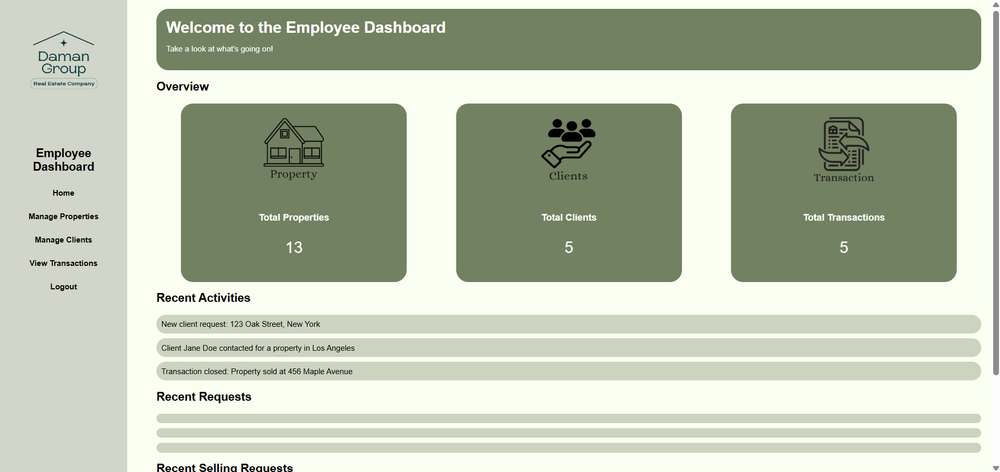

# Real Estate Management System

A database-driven web application developed to manage properties, clients, owners, contracts, and real estate transactions for a real estate company.

## Features

* Buyer, seller, and employee login
* Property listing and filtering
* Client and owner management
* Add, edit, and delete properties
* Contract and transaction management
* Buyer and seller profiles
* Employee dashboard
* Contact and property request management

## Technologies

* PHP
* MySQL
* SQL
* HTML
* CSS
* JavaScript

## Database

The database includes entities for:

* Clients
* Owners
* Employees
* Properties
* Contracts
* Transactions
* Buy requests
* Sell requests
* Contact requests

The SQL script is available in:

```text
Project_real_estate.sql
```

The Entity Relationship Diagram is available in:

```text
ERD.pdf
```

## Screenshots

### Home Page



### Login Page



### Property Filtering



### Buyer Profile



### Seller Profile


### Employee Dashboard



## How to Run

1. Install XAMPP or another PHP and MySQL environment.
2. Clone the repository into the `htdocs` directory.
3. Start Apache and MySQL.
4. Create a database named:

```text
realestatecompany
```

5. Import:

```text
Project_real_estate.sql
```

6. Copy:

```text
MysqlConnection.example.php
```

and rename it to:

```text
MysqlConnection.php
```

7. Add your local MySQL credentials.
8. Open the project in the browser:

```text
http://localhost/real-estate-management-system
```

## Academic Context

Developed as a Database Systems course project at Birzeit University.

## Contributors

* Masa Jalamneh
* Klarien Wassaya
